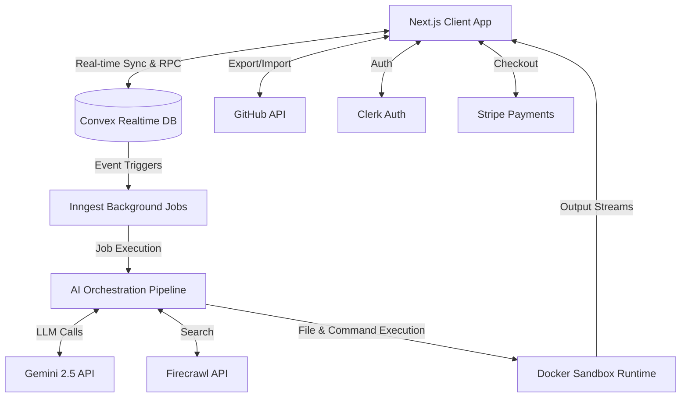
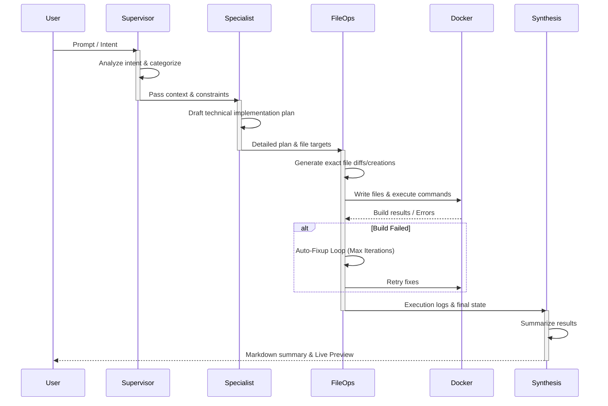
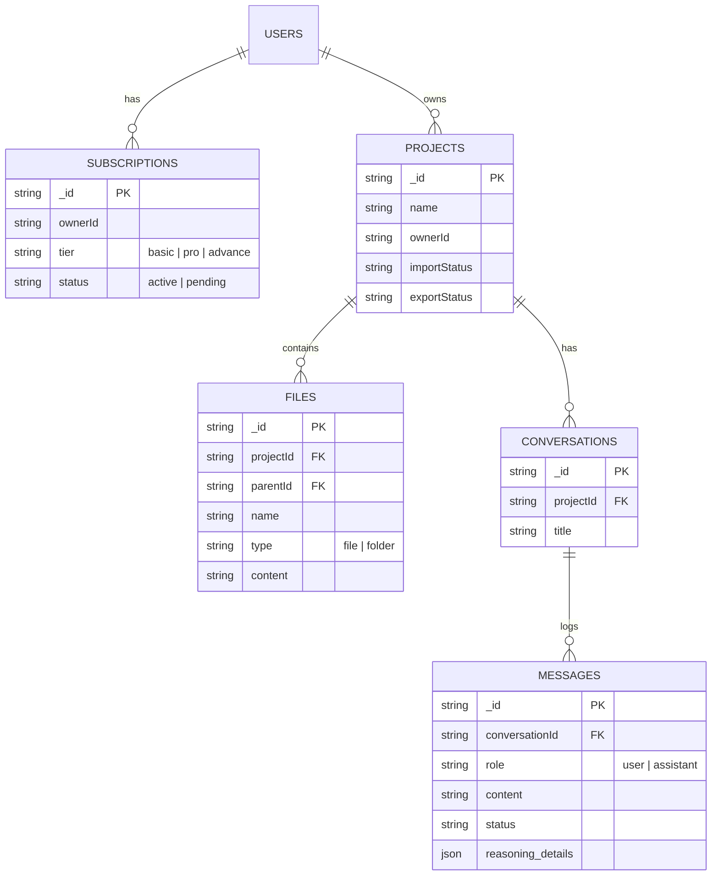

# Orbit

Orbit is an **agentic workspace for frontend teams**, designed to orchestrate planning, code generation, and runtime validation in a single cinematic loop. It empowers developers to build production-grade applications fast, powered by a sophisticated multi-agent AI pipeline and a secure Docker-based runtime.

---

##  Key Features

- **Multi-Agent Orchestration**: Specialized AI agents (Supervisor, Specialist, File Ops, Synthesis) working in concert using Gemini to plan, generate, and refine code.
- **Docker-Backed Runtime**: Deterministic and secure Docker isolation for executing builds, installs, and live preview environments (`orbit-node` & `orbit-python`).
- **Live Pipeline & Execution Trace**: Real-time streaming of planning steps, build output, and execution state straight to the frontend.
- **Frontend-First DNA**: Optimized for Vite, React, and TypeScript.
- **Cloud-Native Data Management**: Real-time sync and durable storage via Convex.
- **GitHub Integration**: Direct export/import to and from GitHub repositories.
- **Monetization & Auth**: Built-in Clerk authentication and tiered Stripe subscriptions for scaling teams.

---

##  System Architecture

Orbit relies on a decoupled, scalable architecture. The Next.js client interacts with Convex for real-time state and Inngest for background job processing, delegating heavy AI orchestration and isolated sandboxing away from the main thread.



---

##  Multi-Agent AI Pipeline

Orbit's core intelligence comes from a meticulously designed sequential agent pipeline. Instead of relying on a single zero-shot LLM, tasks are broken down and handed off to specialized agents.



### Agent Roles:
1. **Supervisor**: Analyzes the user's prompt, establishes the context, and routes to the correct specialist workflow.
2. **Specialist**: Designs the architectural solution, selects the appropriate dependencies, and outlines the step-by-step implementation plan.
3. **File Ops**: The core worker. Takes the plan, generates actual code, applies changes to the virtual filesystem, and handles build verification loops. 
4. **Synthesis**: Reviews the completed execution trace and formulates a coherent, user-facing summary of what was accomplished.

---

##  Data Modeling (Convex)

Orbit's data layer ensures strict relational integrity between workspaces, subscriptions, and AI execution traces.



---

##  Docker Sandbox Runtime

To ensure secure, isolated, and deterministic code execution, Orbit spins up per-project Docker containers (`orbit-node`, `orbit-python`). This runtime handles:
- **Dependency Installation**: `npm install` runs securely outside the host OS.
- **Dev Servers**: Binding Vite / Next.js servers dynamically.
- **Terminal Introspection**: Streaming `stdout` and `stderr` directly to the browser UI via WebSockets.

---

##  Tech Stack

- **Framework**: Next.js 16.2 (App Router) + React 19
- **Styling**: Tailwind CSS v4, Framer Motion, Radix UI
- **AI Models**: Gemini 2.5 Flash / Pro via `@google/genai`
- **Database / Backend**: Convex (Realtime Database & Functions)
- **Background Jobs**: Inngest
- **Auth**: Clerk
- **Payments**: Stripe
- **Sandbox**: Dockerode + custom Docker templates
- **Editor**: Monaco Editor

---

##  Getting Started

### Prerequisites
- Node.js 20+
- Docker (for local sandbox execution)
- Accounts for Convex, Clerk, Stripe, Inngest, and Gemini.

### Installation

1. **Clone the repo**
   ```bash
   git clone https://github.com/yourusername/orbit.git
   cd orbit
   ```

2. **Install dependencies**
   ```bash
   npm install
   ```

3. **Set up environment variables**
   Create a `.env.local` based on the keys provided in your environment:
   ```env
   GEMINI_API_KEY=...
   NEXT_PUBLIC_CONVEX_URL=...
   # (Include Clerk, Inngest, Stripe, and GitHub keys as needed)
   ```

4. **Initialize Docker Sandbox**
   ```bash
   npm run sandbox:setup
   ```

5. **Start the development servers**
   ```bash
   npm run dev:full
   ```
   This will spin up Next.js concurrently with the Inngest local dev server.

---

*Developed by Tarun Kumar Jha.*
